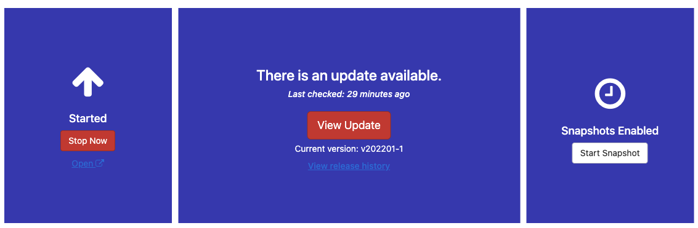
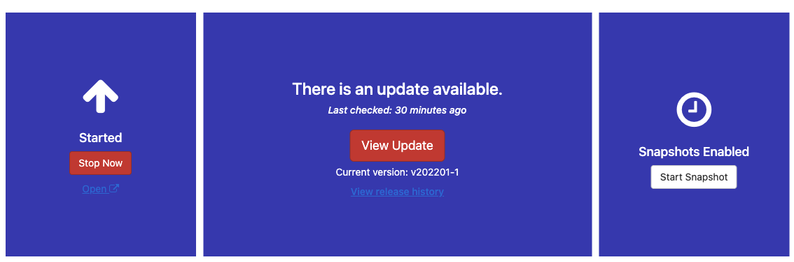
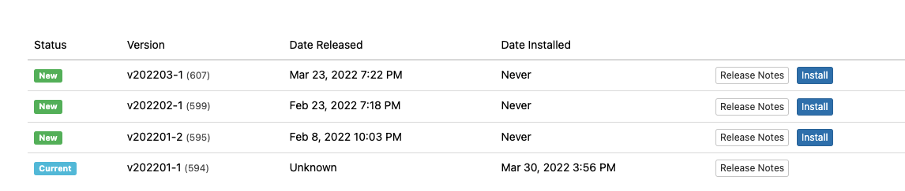
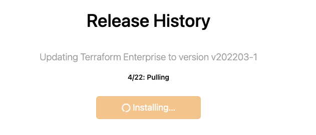
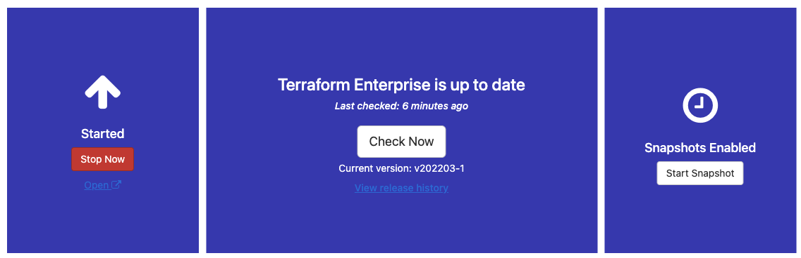

# TFE_upgrade_tests

This repository does an automated installation of TFE (Terraform Enterprise) on an Ubuntu virtual machine with the option to install a specific release. This way you can install an older version and upgrade it to a more recent one

This repo is largely based on another repository. [TFE demo self signed certificate](https://github.com/munnep/TFE_demo_self_signed_certificate)

This repository is based on the official HashiCorp documentation. [See documentation](https://www.terraform.io/enterprise/install/automated/automating-the-installer)


This repo uses Vagrant to create a virtual machine.

Vagrant virtual machine:
- ubuntu virtual machine starts
- TFE settings file are stored under ```/vagrant/config/tfe_settings.json```
- Replicated configuration file are stored under ```/etc/replicated.conf```
- TFE installation script will be downloaded and executed
- the first admin user will be created within TFE to use with settings created under ```/vagrant/config/create_tfe_user.json```

For a manual installation of TFE and upgrade follow [this documentation](manual/README.md) 

# Prerequisites

## Vagrant
Vagrant [See documentation](https://www.vagrantup.com/docs/installation)  
Virtualbox [See documentation](https://www.virtualbox.org/wiki/Downloads)

## License
- Make sure you have a TFE license available for use

# How to
- Clone the repository to your local machine
```
git clone https://github.com/munnep/TFE_upgrade_tests.git
```
- Go to the directory
```
cd TFE_upgrade_tests
```
- save the license file as ```config/license.rli```
- Edit the `Vagrantfile` with the `RELEASE_SEQUENCE` you want to install. [Documentation TFE releases](https://www.terraform.io/enterprise/releases)

Example: Install Release sequence 594 which is version v202201-1 
```
    config.vm.provision "shell", path: "vagrant_scripts/install_tfe.sh",
      env: { "RELEASE_SEQUENCE" => "594" }
```
Example: Install latest release
```
    config.vm.provision "shell", path: "vagrant_scripts/install_tfe.sh",
      env: { "RELEASE_SEQUENCE" => "" }
```
- Start a virtual machine with Vagrant (duration 10 minutes)
```
vagrant up
```
- You should see the following message when Vagrant has started the Virtual machine
```
    default: #######################################################
    default: #              TFE installation complete              #
    default: # TFE dashboard: https://192.168.56.33.nip.io:8800    #
    default: # TFE Application: https://192.168.56.33.nip.io       #
    default: #######################################################
```
- login to the replicated console page
[https://192.168.56.33.nip.io:8800](https://192.168.56.33.nip.io:8800)
- Unlock the console with the password ```Password#1```
- You should see that everything is started.  
  
- Click on the open link which should point you to the TFE application [https://192.168.56.33.nip.io](https://192.168.56.33.nip.io)  
- login using the created account
```
user: admin
password: Password#1
```
  
- Stop the vagrant machine
```
vagrant halt
```
- When you are completely done you can remove it
```
vagrant destroy
```
## Upgrade TFE to a specific version

- login to admin dashboard
[https://192.168.56.33.nip.io:8800/](https://192.168.56.33.nip.io:8800/)
- Click on `view release history` in the middle under View update     
  
- Scroll down and click on the `install` button of the version you wish to install    
  
- Wait until finished. This takes around 10 minutes    
   
- TFE should be upgraded now to the version of choice
    
 


# Done
- [x] Vagrant box
- [x] generate terraform settings.json file
- [x] generate replicated.conf file
- [x] terraform installation script
- [x] First user automation
- [x] Ability to install a certain version of TFE

# To do  