# manual installation TFE demo the specific version with upgrade

This manual describes how to manually install TFE (Terraform Enterprise) to a specific version and after that upgrade to a more recent version

For the official documentation [see this link](https://www.terraform.io/enterprise/install/interactive/installer)

Steps involved:
- Start an ubuntu machine with Vagrant in Virtualbox
- Install TFE
- Configure TFE basics

# Prerequisites

## Vagrant
Vagrant [See documentation](https://www.vagrantup.com/docs/installation)  
Virtualbox [See documentation](https://www.virtualbox.org/wiki/Downloads)

## License
Make sure you have TFE license available for use

# How to

## install TFE to a specific version
- Start the Vagrant box on which we we will install TFE
```
vagrant up
```
- login to the Vagrant box
```
vagrant ssh
```
- Download and run the installation script
```
curl https://install.terraform.io/ptfe/stable > install.sh
```
- install it with the sequence number you want. See overview here [https://www.terraform.io/enterprise/releases](https://www.terraform.io/enterprise/releases)
```
sudo bash install.sh release-sequence=594
```
- For the private ip address choose ```1```
```
Determining local address
The installer was unable to automatically detect the private IP address of this machine.
Please choose one of the following network interfaces:
[0] enp0s3	10.0.2.15
[1] enp0s8	192.168.56.33
Enter desired number (0-1): 1
```
- service IP address can be blank
```
Determining service address
The installer was unable to automatically detect the service IP address of this machine.
Please enter the address or leave blank for unspecified.
Service IP address: 
```
- No need for a proxy ```N```
```
Does this machine require a proxy to access the Internet? (y/N)
```
- Docker and all other things will be downloaded and installed
```
Operator installation successful

To continue the installation, visit the following URL in your browser:

  http://<this_server_address>:8800
```
- In a webbrowser go to the following link ```http://192.168.56.33.nip.io:8800```
- Click Continue to Setup  
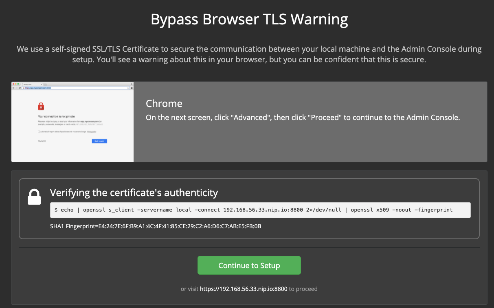    
- Hostname `192.168.56.33.nip.io`
- Select `USE Self-Signed Cert`
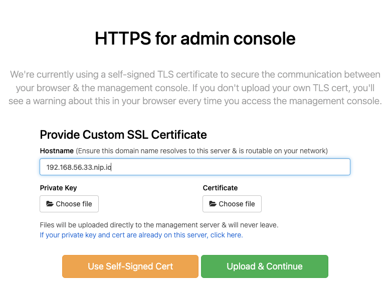  

- Upload your license ```<name>.rli```  
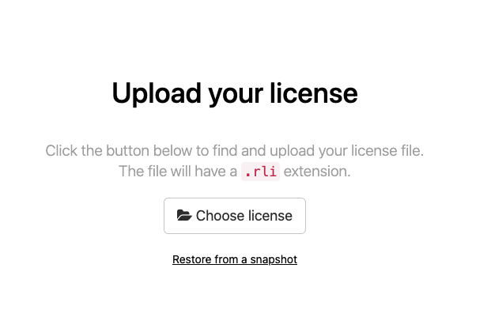    
- Choose ```Online``` installation and click Continue  
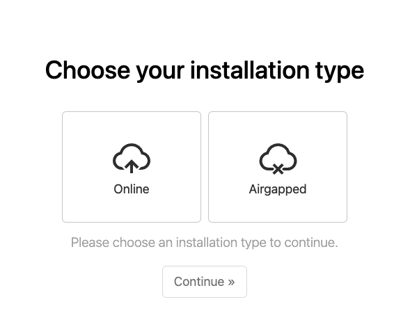    
- Choose password ```Password#1```  
    
- Preflight Checks should be good  
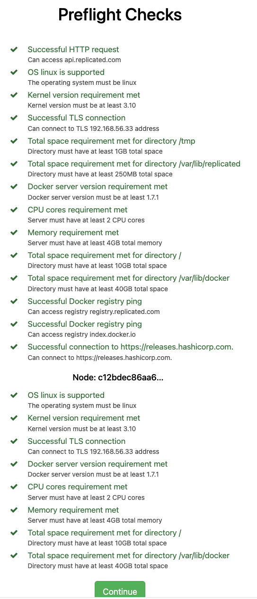    
- You will get on the ```Settings``` page. Configure the below chapters   
    - Hostname: ```192.168.56.33.nip.io```  
    - Encryption password: ```Password#1```  
    - Installation Type: ```Demo```
    - click ```save``` at the bottom of the page 
- On the dashboard you should see the Terraform is up and running and the link with open . This takes around 5 minutes to finish. Notice the version  
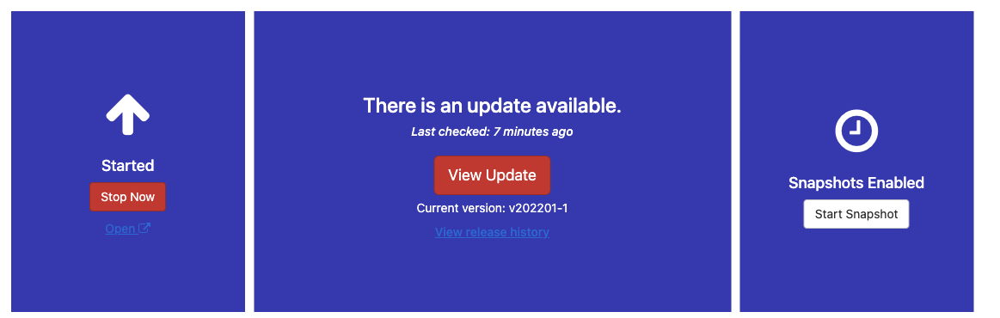  
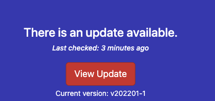  
- create a first account which will be the admin account  
    
- create your organization  
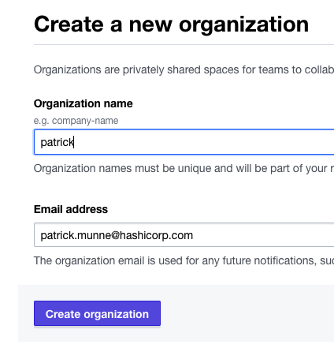    
- You have a running TFE environment which you can use 

## Upgrade TFE to a specific version

- login to admin dashboard
[https://192.168.56.33.nip.io:8800/](https://192.168.56.33.nip.io:8800/)
- Click on view release history in the middle under View update   
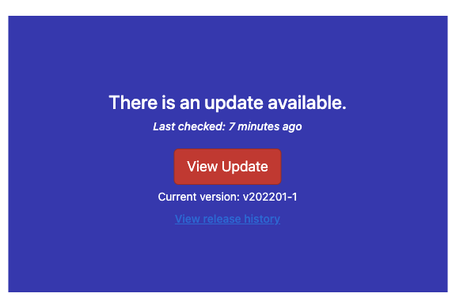  
- You see that the version is currently pinned on the installed version during installation.   
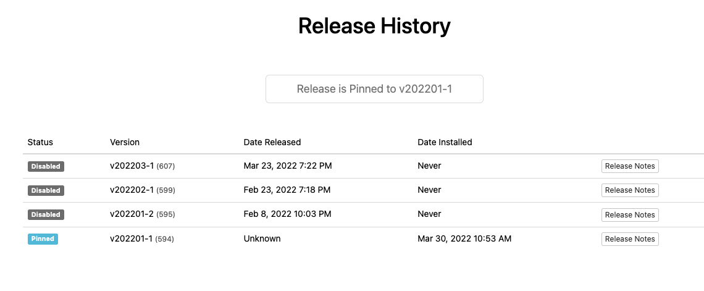   
- Login to the vagrant machine  
```
vagrant ssh
```
- Execute the following command  
```
replicatedctl params set ReleaseSequence --value 0
```
- Go back to the dashboard and check again the version history  
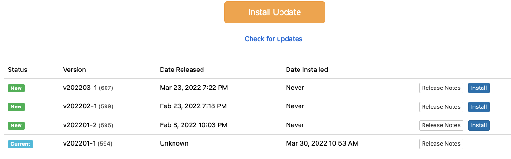  
- select the version you wish to update to and click install    
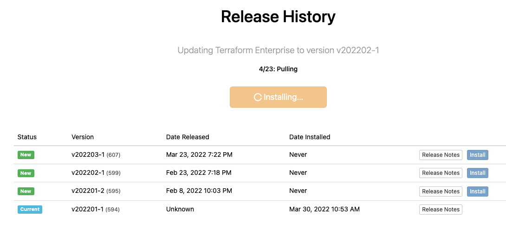  
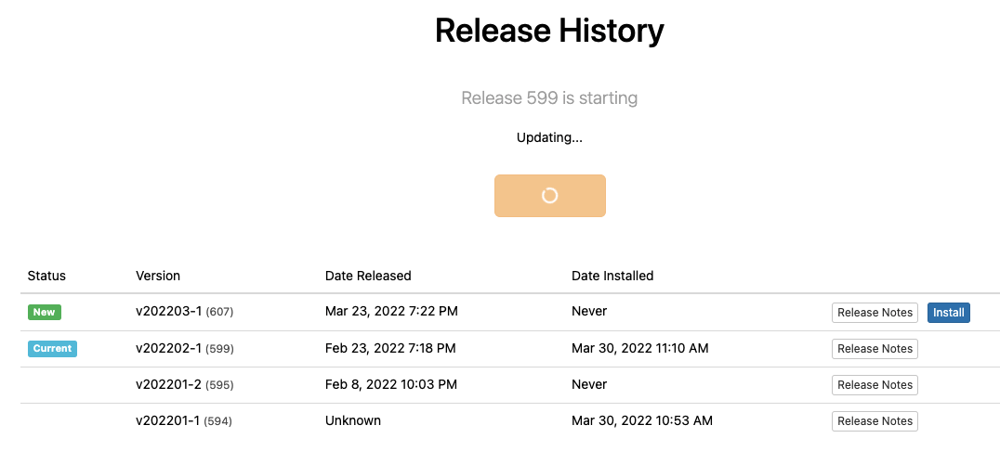  
- Wait until finished. This takes around 10 minutes
- TFE should be upgraded now  
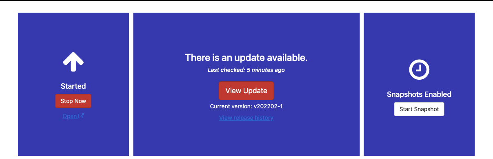  
- Check the version  
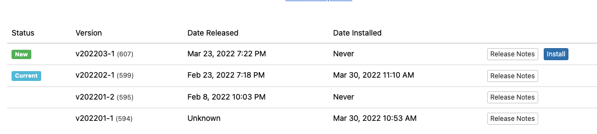  
